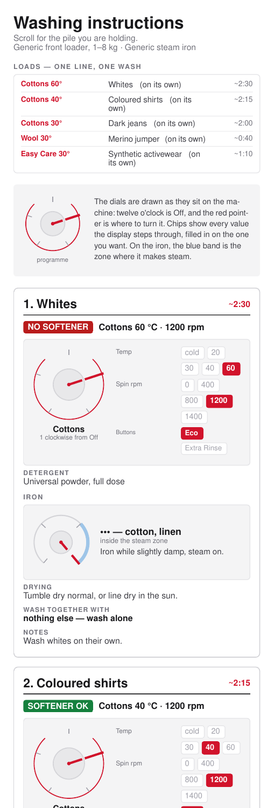
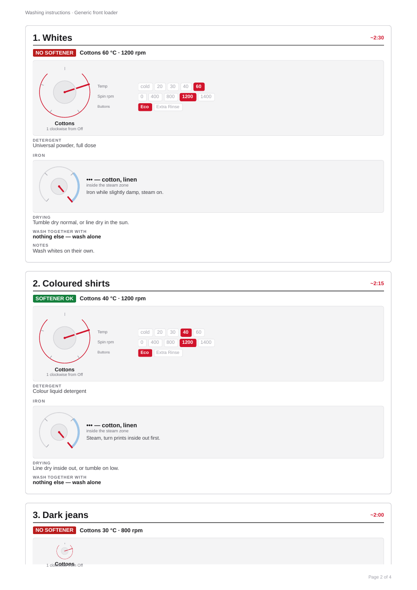
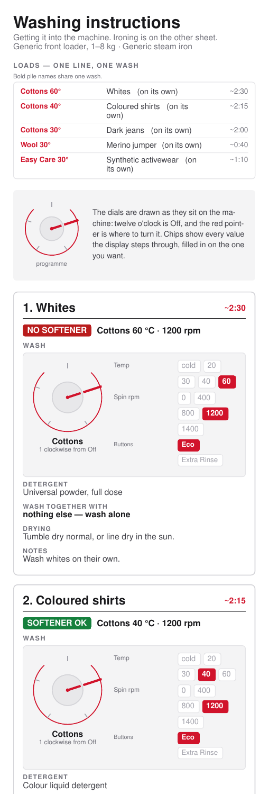
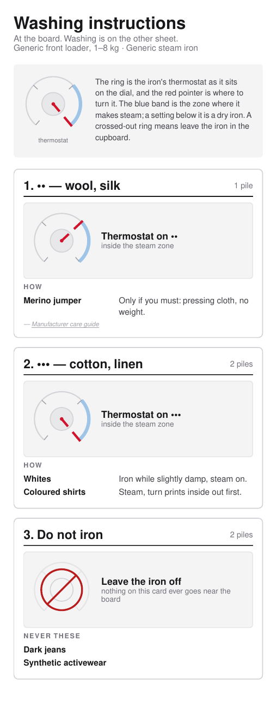
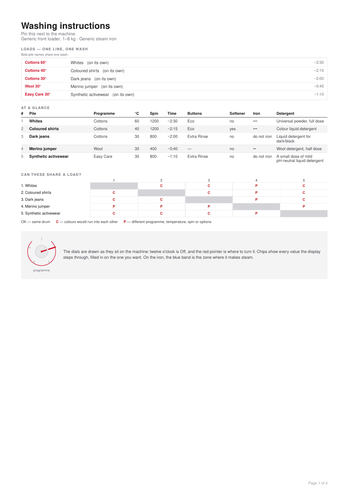
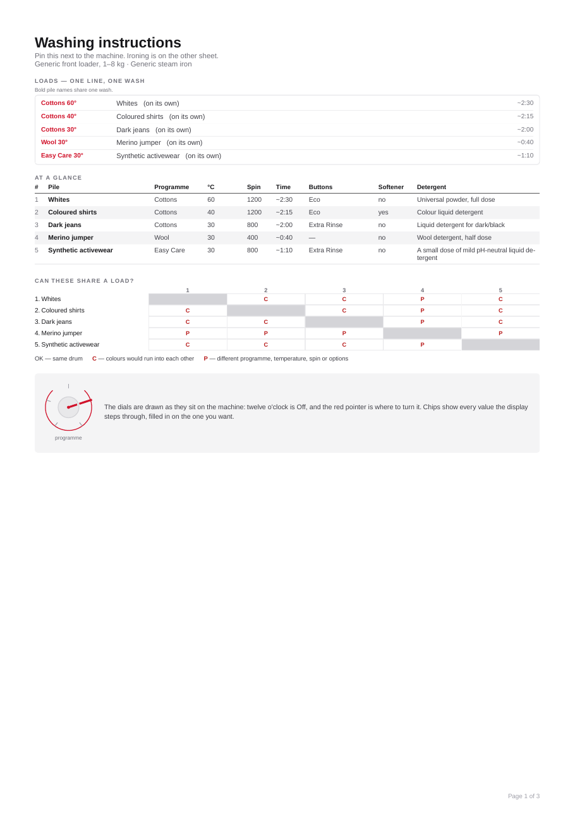
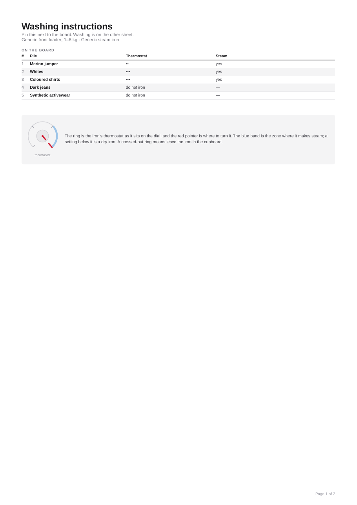

<!--
Maintainer note (not rendered): every badge here measures something real —
do not add one that reads "unknown".
-->

[](https://github.com/alrayyes/washy-washy-pdf/actions/workflows/check.yml)
[](https://codecov.io/gh/alrayyes/washy-washy-pdf)
[](https://github.com/alrayyes/washy-washy-pdf/actions/workflows/release.yml)
[](https://www.npmjs.com/package/@washy-washy/pdf)
[](https://alrayyes.github.io/washy-washy-pdf/)
[](LICENSE)

# @washy-washy/pdf

The `@react-pdf/renderer` components that draw a laundry chart into a PDF —
the phone sheet, the print sheet, and the per-pile reference cards — plus the
layout-fitting logic that measures each one until it lands on exactly one
page. This is the rendering half of [washy-washy-cli](https://github.com/alrayyes/washy-washy-cli),
split out so it can be depended on without the CLI's Bun-specific tooling.
The data half — chart parsing, mixing rules, machine validation — is its
sibling package, [`@washy-washy/core`](https://github.com/alrayyes/washy-washy-sdk).

| The phone sheet, from the top                                                                                                                                                   | A card from the printable set                                                                                                                                                                                 |
| ------------------------------------------------------------------------------------------------------------------------------------------------------------------------------- | ------------------------------------------------------------------------------------------------------------------------------------------------------------------------------------------------------------- |
|  |  |

That's a small example chart, not anyone's real laundry — five piles, chosen
to show a load that shares a drum, a jumper that never sees the iron, and a
thermostat ring with its steam band marked. Every picture below is a link to
the PDF it came out of, so you can read the whole sheet rather than a picture
of the top of it.

**Phone**, top of each sheet:

<p>
  <a href="docs/phone.pdf"></a>
  <a href="docs/phone-wash.pdf"></a>
  <a href="docs/phone-iron.pdf"></a>
</p>

**Printable**, the reference sheet each one opens with:

<p>
  <a href="docs/print.pdf"></a>
  <a href="docs/print-wash.pdf"></a>
  <a href="docs/print-iron.pdf"></a>
</p>

`bun run examples` redraws all six from [`scripts/example-chart.ts`](scripts/example-chart.ts);
`bun run screenshots` re-shoots the PNGs from them. [`test/screenshots.test.ts`](test/screenshots.test.ts)
fails if the two ever fall out of step.

## Requirements

- [Bun](https://bun.sh) or Node, with React 19 available.
- A [`Machine`](https://github.com/alrayyes/washy-washy-sdk) describing the
  washer and iron the chart is drawn for — this package draws nothing without
  one.

## Installation

```sh
bun add @washy-washy/pdf @washy-washy/core react
```

## Usage

```tsx
import { renderCard, renderPhone, renderPrint } from "@washy-washy/pdf";
import { resolve } from "@washy-washy/core";

const items = resolve(instructions); // Instruction[] -> ResolvedInstruction[]

const phone = await renderPhone(items, machine); // { pdf, height, attempts, dropped }
const print = await renderPrint(items, machine); // { pdf, dropped }
const card = await renderCard(items.slice(0, 1), machine); // one pile's group -> { pdf, height, attempts, dropped }
```

`renderPhone` and `renderCard` render repeatedly and bisect the page height
until the sheet fits on exactly one page; `renderPrint` bisects the table
density instead — see [CONTRIBUTING.md](CONTRIBUTING.md#gotchas) for why,
and how far each one can stretch before it gives up.

`dropped` lists the distinct characters the chart carried that this
package's Helvetica font can't render — usually empty. What has a WinAnsi
equivalent (curly quotes, `≈`, `✓`, an ellipsis) is transliterated
automatically; anything else is stripped and named here instead of just
vanishing from the PDF.

Every drawing function takes a `variant` — `"full"`, `"wash"`, or `"iron"` —
for the split sheets: the same chart with the iron's half or the machine's
half left out, for whichever room you're standing in.

`PhoneDocument`, `PrintDocument`, `ReferenceDocument`, and `CardDocument`
are also exported directly, for rendering with your own
`@react-pdf/renderer` pipeline instead of the bisecting helpers above.

The full API reference — every export, its signature, and a runnable
example — is generated with TypeDoc and published at
[`alrayyes.github.io/washy-washy-pdf`](https://alrayyes.github.io/washy-washy-pdf/).
`@washy-washy/core`'s own reference lives at
[`alrayyes.github.io/washy-washy-core`](https://alrayyes.github.io/washy-washy-core/).

## Contributing

Everything about working on this — the commands, the linters, the tests, the
git hooks and how a release is cut — is in
[CONTRIBUTING.md](CONTRIBUTING.md). Short version: `bun run check` before you
push, commit under [Conventional Commits](https://www.conventionalcommits.org/).

## Licence

GPL-3.0-or-later. Use it, change it, pass it on — but anything you distribute
that is built on it comes with the same freedom attached, source included.
